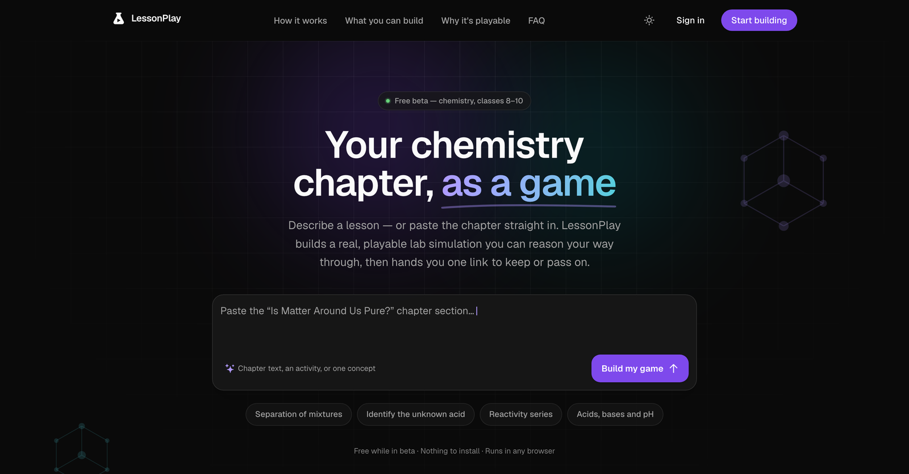
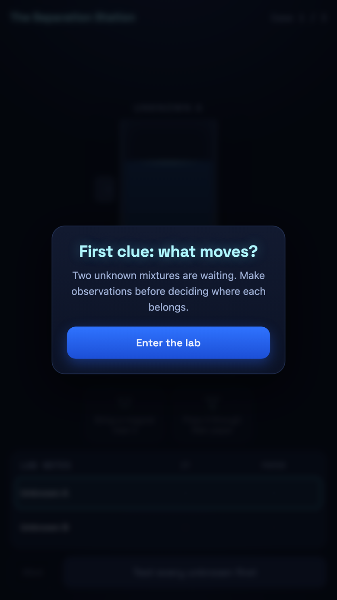
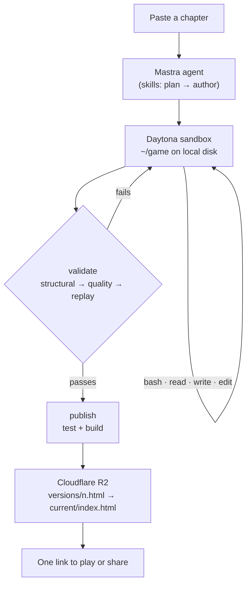

<div align="center">


# LessonPlay

**Give it a chemistry chapter. Get a playable lab.**

An open-source studio where an AI agent turns a chemistry chapter into a real, playable
simulation — and proves it's winnable before anyone plays it.

Built for school chemistry, classes 8–10.

<p>
  <a href="https://www.lessonplay.space"></a>
  <a href="#quickstart"></a>
</p>

<p>
  <a href="LICENSE"></a>
  <a href="https://github.com/builtbyrishabh/lessonplay/actions/workflows/ci.yml"></a>
  
  
  <a href="CONTRIBUTING.md"></a>
</p>

<a href="https://www.lessonplay.space">
  
</a>

</div>

---

## What it is

Describe a lesson in one sentence — or paste the chapter straight in. LessonPlay's
agent designs the game, writes the code in a sandbox, plays it to a win to prove it
works, and hands back one link.

It doesn't assume who you are. A student revising acids and bases on their own, a
teacher building something for Monday, a parent helping with homework, or anyone
curious why the reaction goes the way it does — same studio, same one link.

**[Try it at lessonplay.space →](https://www.lessonplay.space)** — free while in beta, nothing to install.

## What you get to play

<table>
<tr>
<td width="30%">
  
</td>
<td valign="top">

Not a quiz with a chemistry skin. Each game is a **cause-and-effect simulation**:
a consistent world the learner probes to identify an unknown salt, predict a
reaction, or reach a target state.

The loop is **Predict → Act → Observe → Reconcile**. You pick a material, try a
tool, and reason from what you see — *"classify the unknown from observations
rather than its label."*

Every game ships as one self-contained `index.html` (~0.3–1.5 MB). No install, no
plugin, no account, no sign-in to play. Keep the link or pass it on — it opens in
any browser, on a phone as readily as a laptop.

<sub>Pictured: <i>The Separation Station</i> — a real game built and published by the studio.</sub>

</td>
</tr>
</table>

> **Status:** early. Chemistry for classes 8–10 first, one game template, actively
> built in the open. Expect sharp edges.

## Why it's interesting

Most "AI builds you an app" demos stop at generating code. The hard part in
education isn't generation — it's **trust**. A game that can't be won, or that
can be won by guessing, is worse than no game at all.

So the interesting machinery here is the part that says *no*:

- **The agent works in a real sandbox.** One Daytona VM per chat thread, with the
  engine pre-installed and the project already scaffolded — so the model edits
  something that already builds, installs, and tests.
- **A three-stage gate guards publishing.** Structural → quality → replay. The
  last stage actually *plays the game to a win* through the real session reducer.
  Not an LLM grading itself.
- **The gate is enforced, not asserted.** `publish` runs the identical validation
  string the agent can run itself, and refuses on failure. There is no path to a
  shared link that skips it.

## How it works



**The two storage halves.** `~/game` is local sandbox disk — where the agent
builds and tests. `~/r2` is an s3fs mount of `games/<userId>/<threadId>/`. The
`publish` tool is the only crossing between them, and it gates the crossing. Each
publish keeps its own build, so an older version stays previewable while
`current/` remains the stable link that was already shared.

**The validation gate**, in order — each stage runs only when the last is clean:

| Stage | Asks | Fails when |
| --- | --- | --- |
| **Structural** | Is this a well-formed game? | Schema, dangling references, unreachable stations |
| **Quality** | Is it worth playing? | Not winnable, guessable, or railed onto one path |
| **Replay** | Does it actually work? | The real session reducer can't play it to a win |

Exit codes are `0` (clean), `1` (game has errors), `2` (game not found) — never
`0` on a game it could not read.

## Stack

Next.js App Router · tRPC · Drizzle + Postgres · Clerk · Tailwind v4 ·
[Mastra](https://mastra.ai) agents · [Vercel AI Gateway](https://vercel.com/ai-gateway) ·
[Daytona](https://daytona.io) sandboxes · Cloudflare R2

## Quickstart

**Prerequisites:** Node 20+, pnpm 10+, Docker (for local Postgres).

```bash
git clone https://github.com/builtbyrishabh/lessonplay.git
cd lessonplay
pnpm install

cp .env.example .env      # then fill in the keys below
./start-database.sh       # local Postgres on port 5433
pnpm db:push
pnpm dev                  # http://localhost:3000
```

### Keys you'll need

The homepage and the full test suite run without any of these. Chat needs the
first three; building and publishing a game needs all of them.

| Variable | Where to get it | Needed for |
| --- | --- | --- |
| `DATABASE_URL` | `./start-database.sh` sets this up locally | Everything |
| `NEXT_PUBLIC_CLERK_PUBLISHABLE_KEY`, `CLERK_SECRET_KEY` | [Clerk dashboard](https://dashboard.clerk.com) | Sign-in |
| `AI_GATEWAY_API_KEY` | [Vercel AI Gateway](https://vercel.com/ai-gateway) | Chat |
| `DAYTONA_API_KEY`, `DAYTONA_SNAPSHOT` | [Daytona](https://app.daytona.io) + `pnpm snapshot:build` | Sandbox |
| `R2_*` | [Cloudflare R2](https://developers.cloudflare.com/r2/) | Preview & publish |

Full annotated list: [`.env.example`](.env.example). The schema that validates
them at boot: [`src/env.js`](src/env.js).

<details>
<summary><b>Building the sandbox image</b></summary>

<br>

Sandboxes boot from a base snapshot holding the engine and s3fs. Build one, then
point `DAYTONA_SNAPSHOT` at it:

```bash
pnpm snapshot:build lessonplay-base-v4
```

Snapshots are **immutable** — engine changes need a new name. Existing thread
sandboxes keep the snapshot they were born from.

</details>

## Repo layout

```text
src/
  app/(marketing)/     Public homepage — the only non-auth route besides sign-in
  app/(app)/           The studio, behind Clerk
  mastra/              Agent factory, prompts, and its six tools
    tools/             bash · read · write · edit · validate · publish
  server/sandbox/      Daytona lifecycle + the scripts that run inside it
  components/chat/     Split-pane workspace: conversation | preview & code

game-engine/           Self-contained. Own package.json and lockfile; excluded
  packages/            from the app's tsconfig and never imported in-process —
    learn-loop-core/   the agent copies it into the sandbox and installs there.
  games/
    chemistry-lab-bench/   The starter template every new game is scaffolded from

.agents/skills/        Game-design skills, served by the app (not the sandbox)
  discovery-game-planner/   Chapter → approved game brief
  experiment-lab-game/      Cause-and-effect discovery games
  chemquest-lab-game/       Guided 9:16 lab missions
```

Two details worth knowing before you edit:

- **`game-engine/` is deliberately not in the app's dependency graph.** It has its
  own lockfile and is installed inside the sandbox. Don't `import` it from `src/`.
- **`.agents/skills` and `.claude/skills` are byte-identical mirrors.** Edit both,
  or the agent and your editor disagree.

## Development

```bash
pnpm typecheck                      # app types
pnpm test                           # app tests — in-memory, no services needed
cd game-engine && npm test          # engine tests — standalone
```

Tests that need live services are opt-in and skipped by default:

```bash
pnpm sandbox:smoke                          # live Daytona + R2: mount → publish → hydrate
PG_INTEGRATION=1 DATABASE_URL=... npx vitest run chats.pg   # real Postgres
```

## Contributing

Good first issues are labelled [`good first issue`](https://github.com/builtbyrishabh/lessonplay/labels/good%20first%20issue).
The areas most open to help right now:

- **New game templates** beyond chemistry — the engine is domain-agnostic by design
- **Validator rules** that catch more bad-game patterns
- **Skill authoring** — better references mean less agent flailing

Start with [CONTRIBUTING.md](CONTRIBUTING.md). Security issues go to
[SECURITY.md](SECURITY.md), not the public tracker.

## License

[Apache License 2.0](LICENSE) © 2026 Rishabh Singh.

The rule-engine pattern in `@learn-loop/core` is adapted from the MIT-licensed
[chem_lab](https://github.com/nsriram/chem_lab); see
[`NOTICE`](game-engine/packages/learn-loop-core/NOTICE) for the full attribution.
The studio UI is ported from Vercel's `v0-clone` example onto shadcn/ui.

<div align="center"><sub>Built by <a href="https://github.com/builtbyrishabh">@builtbyrishabh</a> · <a href="https://www.lessonplay.space">lessonplay.space</a></sub></div>
